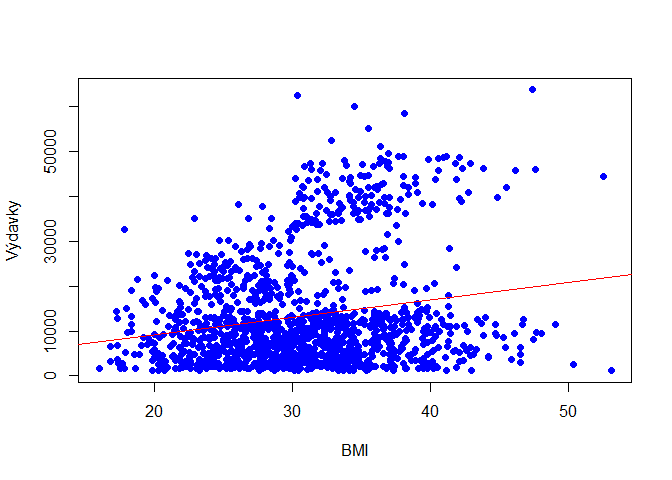
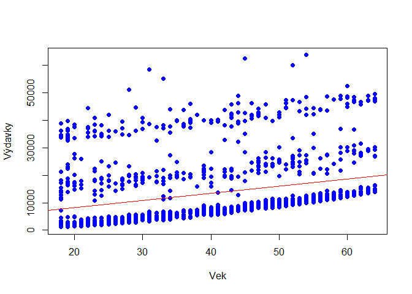
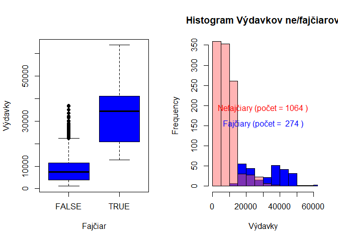

# Štatistická úloha

Zdroj dát: <https://www.kaggle.com/datasets/mirichoi0218/insurance>

GitHub repozitár: <https://github.com/corovcam/statisticka-uloha>

Budeme skúmať dáta zdravotných výdavkov hradených poisťovňami
jednotlivým poistencom v USA vo veku od 18 do 64 rokov získaných z
otvorenej databázy Kaggle.com.

## Načítanie dát

``` r
library(readr)
data <- read_csv("insurance_modified.csv", 
                 col_types = cols(age = col_integer(), 
                                  sex = col_integer(),
                                  children = col_integer(), 
                                  smoker = col_logical()
                                  ))
head(data)
```

    ## # A tibble: 6 × 7
    ##     age   sex   bmi children smoker region    charges
    ##   <int> <int> <dbl>    <int> <lgl>  <chr>       <dbl>
    ## 1    19     1  27.9        0 TRUE   southwest  16885.
    ## 2    18     0  33.8        1 FALSE  southeast   1726.
    ## 3    28     0  33          3 FALSE  southeast   4449.
    ## 4    33     0  22.7        0 FALSE  northwest  21984.
    ## 5    32     0  28.9        0 FALSE  northwest   3867.
    ## 6    31     1  25.7        0 FALSE  southeast   3757.

## Vizualizácia dát

``` r
par(mfrow = c(1, 2))
hist(data$age, main = "Vek")
hist(data$bmi, main = "BMI")
```

<!-- -->

``` r
par(mfrow = c(1, 2))
hist(data$charges, main = "Výdavky")
plot(factor(data$smoker), main = "Fajčiary", xlab = "NE-Fajčiar (FALSE-TRUE)",
     ylab = "Frequency")
```

<!-- -->

## Testovanie závislostí

Vytvoríme si korelačný graf využitím externej knižnice “psych”. V grafe
si vyznačíme korelačné koeficienty využitím Pearsonej metódy, zobrazíme
histogramy a funkciu hustoty jednotlivých stĺpcov.

``` r
# install.packages("psych")
library(psych)

pairs.panels(data[-6],
             smooth = TRUE,      # If TRUE, draws loess smooths
             scale = FALSE,      # If TRUE, scales the correlation text font
             density = TRUE,     # If TRUE, adds density plots and histograms
             ellipses = TRUE,    # If TRUE, draws ellipses
             method = "pearson", # Correlation method (also "spearman" or "kendall")
             pch = 21,           # pch symbol
             cor = TRUE,         # If TRUE, reports correlations
             jiggle = FALSE,     # If TRUE, data points are jittered
             factor = 2,         # Jittering factor
             hist.col = 4,       # Histograms color
             stars = TRUE,       # If TRUE, adds significance level with stars
             ci = TRUE)          # If TRUE, adds confidence intervals
```

<!-- -->

Budeme testovať potencionálnu koreláciu medzi najpravdepodobnejšími
dvojicami hodnôt pomocou lineárnej regresie. Využijeme na to vstavanú
funckiu lm().

### Korelácia medzi Vekom a BMI

``` r
age_bmi_lm = lm(age~bmi, data)
plot(data$age, data$bmi, pch = 16, col = "blue", xlab = "Vek", ylab = "BMI")
abline(age_bmi_lm, col = "red")
```

<!-- -->

``` r
summary(age_bmi_lm)
```

    ## 
    ## Call:
    ## lm(formula = age ~ bmi, data = data)
    ## 
    ## Residuals:
    ##      Min       1Q   Median       3Q      Max 
    ## -26.8632 -12.5477   0.3053  11.6915  26.7248 
    ## 
    ## Coefficients:
    ##             Estimate Std. Error t value Pr(>|t|)    
    ## (Intercept) 31.48728    1.95884  16.074  < 2e-16 ***
    ## bmi          0.25176    0.06266   4.018 6.19e-05 ***
    ## ---
    ## Signif. codes:  0 '***' 0.001 '**' 0.01 '*' 0.05 '.' 0.1 ' ' 1
    ## 
    ## Residual standard error: 13.97 on 1336 degrees of freedom
    ## Multiple R-squared:  0.01194,    Adjusted R-squared:  0.0112 
    ## F-statistic: 16.15 on 1 and 1336 DF,  p-value: 6.194e-05

``` r
paste("Korelačný index: r =", cor(data$age, data$bmi))
```

    ## [1] "Korelačný index: r = 0.109271881548535"

Korelačný index je r=0.11 čo je menej ako 0.2, čo znamená že medzi Vekom
a BMI je veľmi slabá až žiadna korelácia.

### Korelácia medzi BMI a Výdavkami

``` r
bmi_charges_lm = lm(bmi~charges, data)
plot(data$bmi, data$charges, pch = 16, col = "blue", xlab = "BMI", 
     ylab = "Výdavky")
abline(bmi_charges_lm, col = "red")
```

<!-- -->

``` r
summary(bmi_charges_lm)
```

    ## 
    ## Call:
    ## lm(formula = bmi ~ charges, data = data)
    ## 
    ## Residuals:
    ##      Min       1Q   Median       3Q      Max 
    ## -14.8424  -4.1030  -0.2401   3.8467  23.6758 
    ## 
    ## Coefficients:
    ##              Estimate Std. Error t value Pr(>|t|)    
    ## (Intercept) 2.934e+01  2.426e-01 120.956  < 2e-16 ***
    ## charges     9.988e-05  1.350e-05   7.397 2.46e-13 ***
    ## ---
    ## Signif. codes:  0 '***' 0.001 '**' 0.01 '*' 0.05 '.' 0.1 ' ' 1
    ## 
    ## Residual standard error: 5.979 on 1336 degrees of freedom
    ## Multiple R-squared:  0.03934,    Adjusted R-squared:  0.03862 
    ## F-statistic: 54.71 on 1 and 1336 DF,  p-value: 2.459e-13

``` r
paste("Korelačný index: r =", cor(data$bmi, data$charges))
```

    ## [1] "Korelačný index: r = 0.198340968833629"

Vo výsledku je trochu silnejšia korelácia oproti predošlému vzťahu ale
stále nízka.

### Korelácia medzi Vekom a Výdavkami

``` r
age_charges_lm = lm(age~charges, data)
plot(data$age, data$charges, pch = 16, col = "blue", xlab = "Vek", 
     ylab = "Výdavky")
abline(age_charges_lm, col = "red")
```

<!-- -->

``` r
summary(age_charges_lm)
```

    ## 
    ## Call:
    ## lm(formula = age ~ charges, data = data)
    ## 
    ## Residuals:
    ##      Min       1Q   Median       3Q      Max 
    ## -30.0609 -11.4222   0.1691  11.1759  24.6013 
    ## 
    ## Coefficients:
    ##              Estimate Std. Error t value Pr(>|t|)    
    ## (Intercept) 3.460e+01  5.441e-01   63.60   <2e-16 ***
    ## charges     3.469e-04  3.029e-05   11.45   <2e-16 ***
    ## ---
    ## Signif. codes:  0 '***' 0.001 '**' 0.01 '*' 0.05 '.' 0.1 ' ' 1
    ## 
    ## Residual standard error: 13.41 on 1336 degrees of freedom
    ## Multiple R-squared:  0.08941,    Adjusted R-squared:  0.08872 
    ## F-statistic: 131.2 on 1 and 1336 DF,  p-value: < 2.2e-16

``` r
paste("Korelačný index: r =", cor(data$age, data$charges))
```

    ## [1] "Korelačný index: r = 0.299008193330648"

Môžeme vidieť že síce korelačný index (r=0.29) je pomerne malý (slabá
korelace), ale p-hodnota je \< 2.2e-16, čiže pod 0.1% hladinou
významnosti. Našu hypotézu teda môžeme zamietnuť a tvrdiť že medzi Vekom
a Výdavkami je lineárny vzťah. Taktiež spomedzi všetkých predošlých
nameraných r-koeficientov je tento najvyšší, a teda vzťah Vek\~Výdavky
je z predošlých vzťahov lineárne najbližší.

### Vzťah medzi skupinami Výdavkov Fajčiarov a Nefajčiariov

Podľa Korelačného grafu na začiatku, by korelačný index medzi
Ne/Fajčiarmi a Výdavkami mal byť r=0.79. Poďme teda skúmať túto
závislosť.

``` r
par(mfrow = c(1, 2))
smoker_charges_lm = lm(smoker~charges, data)
plot(factor(data$smoker), data$charges, pch = 16, col = "blue", xlab = "Fajčiar", 
     ylab = "Výdavky")
abline(smoker_charges_lm, col = "red")

groups = split(data$charges, data$smoker)
hist(groups$'TRUE', col = "blue", xlab = "Výdavky", 
     main = "Histogram Výdavkov ne/fajčiarov", xlim = c(0, 60000), 
     ylim = c(0, 350))
par(new = TRUE)
light_color <- rgb(255, 102, 102, max = 255, alpha = 125, names = "lightred50")
hist(groups$'FALSE', col = light_color, main = "", axes = FALSE, xlab = "", 
     ylab = "", xlim = c(0, 60000), ylim = c(0, 350))
text(30000, 175, paste("Nefajčiary (počet =", length(groups$'FALSE'), ")"), 
     col = "red", pos = 3)
text(30000, 175, paste("Fajčiary (počet = ", length(groups$'TRUE'), ")"), 
     col = "blue", pos = 1)
```

<!-- -->

Z boxového diagramu naľavo vidíme, že priemerné výdavky nefajčiarov sú
oveľa menšie ako priemerné výdavky fajčiarov. Z histogramu napravo
vidíme že aj keď je nefajčiarov ovela viac, tak výdavky jednotlivcov sú
oveľa menšie ako výdavky jednotlivých fajčiarov.

## Normálne rozdelenie BMI

Z histogramu BMI hodnôt si môžeme všimnúť že sa rozdelenie hodnôt podobá
normálnemu rozdeleniu (až na určituú deformáciu zprava). Môžeme teda
skúmať túto závislosť.

``` r
hist(data$bmi)
```

<!-- -->

``` r
library(ggpubr)
ggdensity(data$bmi, main = "Graf hustoty BMI hodnôt", xlab = "BMI", 
          ylab = "Hustota")
```

<!-- -->

Graf hustoty, podobný histogramu, má vizuálne tvar normálneho
rozdelenia, avšak pri pohľade sa zdá že je graf viac naľavo.

``` r
ggqqplot(data$bmi)
```

<!-- -->

Hodnoty v Q-Q grafe sa nachádzajú väčšinou pozdĺž referenčnej priamky,
avšak hodnoty nízkeho BMI poukazujú na určité anomálie. Nevieme, či sú
dané anomálie normálne v populácii alebo sú spôsobené chybou merania.
BMI je podiel hmotnosti a výšky človeka na druhú a BMI od 10-18.5 sa
považuje za podváhu čo približne odpovedá našej anomálii. Taký človek by
musel byť vysoký s malou váhou. Avšak takých hodnôt nie je veľa a pri
našom malom počte meraní nevieme presne určiť o čo ide.

### Test normality

Vizuálna inšpekcia BMI poukazuje na normalitu, poďme otestovať túto
hypotézu pomocou Shapiro-Wilkovho testu normality.

``` r
shapiro.test(data$bmi)
```

    ## 
    ##  Shapiro-Wilk normality test
    ## 
    ## data:  data$bmi
    ## W = 0.99389, p-value = 2.605e-05

P-hodnota je menšia ako 0.05 hladina významnosti čiže musíme našu nulovú
hypotézu zamietnuť. Nemôžeme teda predpokladať normalitu BMI nášho
merania s 1338 vzorkami.
